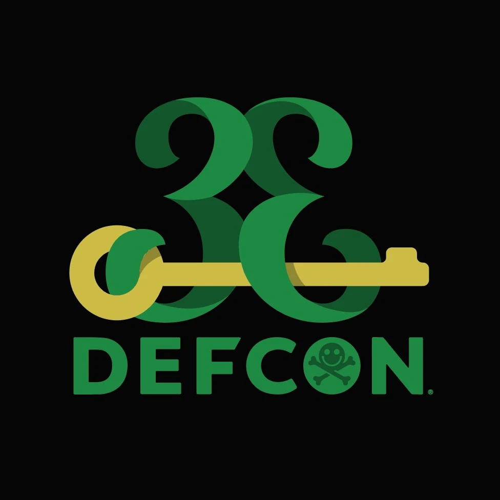

# DEF CON 33 - Conference Notes and Exploration

[](https://defcon.org)
[](https://www.gnu.org/software/guile/)
[](https://github.com/dsp-dr/defcon33)
[](https://github.com/dsp-dr/defcon33)

> Analyzing DEF CON presentations through the lens of Guile Scheme - conference notes, session tools, and hacker culture exploration

## Overview

This repository explores DEF CON 33 through Guile Scheme, documenting:

- Conference session notes and analysis
- Presentation content through a Scheme lens
- Hacker culture and community observations
- Technical demonstrations in functional programming
- Village activities and workshop notes
- Security research methodologies



## Live Streaming & Resources

### Current Streams (August 7-10, 2025)
- **YouTube**: [@DEFCONConference/streams](https://www.youtube.com/@DEFCONConference/streams)
- **DEF CON TV**: [dctv.defcon.org](https://dctv.defcon.org/)
- **Info Node**: [info.defcon.org](https://info.defcon.org/content/?id=61973)

### Check Live Streams
```bash
# Check for currently live DEF CON streams
./bin/check-live-streams.sh
```

### LLM/AI Focus Sessions
Tracking AI, machine learning, and LLM security presentations:

#### Key AI/LLM Tracks & Villages
- **AI Village**: [Track 3] - Hands-on AI security research and demonstrations
- **Main Stage**: DARPA AI Cyber Challenge presentations
- **Track 1**: Advanced AI exploitation and defense techniques
- **Track 2**: LLM security and adversarial research
- **Track 4**: Machine learning in cybersecurity applications

#### Featured AI/LLM Talks
- AI exploitation techniques and defenses
- LLM vulnerability research and jailbreaking
- Machine learning model poisoning
- Adversarial AI demonstrations
- Automated security tools using AI
- Privacy attacks on ML models
- AI-powered threat detection

### Schedule & Tracking
- **Hacker Tracker**: [hackertracker-info](./hackertracker-info/) - Real-time schedule
- **Info Export**: [info-export](./info-export/) - Conference data exports
- **Official Schedule**: [info.defcon.org](https://info.defcon.org/content/?id=61973)

## Quick Start

```bash
# Check for live streams
./bin/check-live-streams.sh

# Download presentations from DEF CON media server
gmake mirror

# List AI/LLM related talks
gmake ai-talks

# Analyze presentation topics
gmake analyze

# View/edit analysis notes
gmake notes

# Show all available commands
gmake help
```

## Project Structure

```
defcon33/
├── .mirror/          # Downloaded presentations (gitignored)
├── modules/          # Guile Scheme analysis modules
├── bin/              # Utility scripts
├── ANALYSIS.md       # Conference analysis notes
└── defcon-logo.png   # DEF CON 33 logo
```

## Analysis Focus

- **AI/LLM Security**: Tracking presentations on AI exploitation, LLM vulnerabilities
- **Functional Programming**: Analyzing security concepts through Scheme/Lisp perspective
- **Hacker Culture**: Documenting community insights and technical innovations
- **Emerging Threats**: Identifying new attack vectors and defense strategies

## Requirements

- GNU Guile 3.0+
- GNU Make
- Git

## License

Public repository - Conference notes and educational content